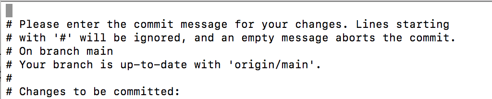
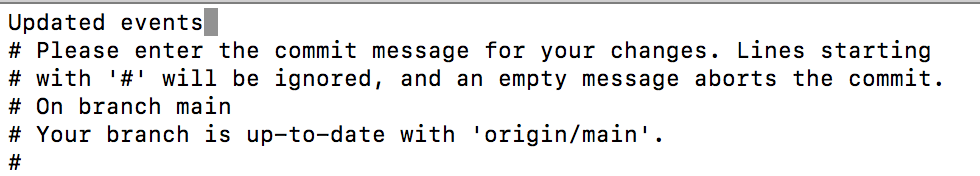

# Event-Listings

A widget to add upcoming SCDS events to scds.ca

## Purpose

This repository contains a GitHub site of an SCDS events widget so that other websites (like scds.ca) can embed it into their pages. The events are from McMaster's SCDS LibCal, and are not connected through API calls, but through a web scraper script.

## How to Use

### Adding Events to a Page

There are two formats that the events widget is arranged in:

- (a grid format)["style-2-grid"], to be embedded in https://scds.ca/events/
- (a carousel slider format)["events-carousel"] to be embedded in https://scds.ca home page.

**Carousel Slider**

To add the events carousel slider to an SCDS WordPress page, use a shortcode block and include the following line:  
```[iframe src="https://learn.scds.ca/event-listings/events-carousel" width="100%" scrolling="no" height="400px" ]```

To add the events carousel to any other page, use the following iframe code:  
```html
<iframe src="https://learn.scds.ca/event-listings/events-carousel" width="100%" scrolling"yes" height="400px">
</iframe>
```

**Events Grid**

To add the events grid to an SCDS WordPress page, use a shortcode block and include the following line:  
```[iframe src="https://learn.scds.ca/event-listings/style-2-grid" width="100%" height="1200px" scroll="yes"]```

To add the events carousel to any other page, use the following iframe code:  
```html
<iframe src="https://learn.scds.ca/event-listings/style-2-grid" width="100%" scrolling"yes" height="1200px">
</iframe>
```


### Adding/updating Events Manually

To add or update the events that are listed, you have to modify `_data/events.json`. 

When an event is over or a new event is added, update the information in `_data/events.json`. This can be done manually or through automation.

In `_data/events.json`, an event will have the following data. To remove the event manually, erase the event's information along with its opening and closing brackets {} and any comma that follows. 

The event's information includes:

- "uid": "LibCal-7565-3920895" (SCDS LibCal ID)
- "title": The event/workshop title
- "start": Start time of event in ISO 8601 date and time format.
- "end": End time of event in ISO 8601 date and time format.
- "description": Event description
- "location": Event location
- "url": LibCal URL of event for registration
- "image": Image URL of event from the event's LibCal page. Event images are not stored in this event-listings github repository.

### Adding/updating Events Automatically (Must be Done Locally)

Clone this repository onto your computer. Go to your computer's terminal and locate where you want this repository to be cloned.

Install node.js to your computer. Download link is at nodejs.org/en/download

Open your computer terminal and locate the event-listings repository. For example, if event-listings was cloned in your Documents folder, type the following into terminal:

```cd Documents/event-listings/``

Update events by typing the following into the terminal:

```node assets/js/fetch-events.js```

This will populate `_data/events.json` with updated events information.

Then type the following in terminal:

```git commit --all```
The terminal will change to something like the following.


Type 'a' which will allow you to add a commit message. In this case, it would be `updated events`.



Once done, press the esc button and type `:wq` and press the Enter button, which will allow you to escape the message window.

Then, enter the following in terminal:

```git push```

The updated events will now populate onto the event widgets. You're done!


### Relevant Backend Search Code

If edits to the code are required, see the below.

- `assets/js/fetch-events.js` scrapes data from (SCDS's LibCal)["https://libcal.mcmaster.ca/calendar/scds?cid=7565&t=g&d=0000-00-00&cal=7565&inc=0"], which includes the event image banner, the event link, event time and location.
- The other file that contains code for the search widget is in `index.md`. This includes how entries should look, as well as some other entries on how searching should work (fuzzy search toggle, limit of searches per load, etc.).
- `events.json`: an automatically generated file that compiles the CSV workshop list into JSON data that the JavaScript interfaces with. This file is generated when the website is reloaded (aka when commits are made), so no edits should be needed to be done to this file, unless a new label is required to be used. Template language used is Liquid: <https://shopify.github.io/liquid/>.

## Credits

Made by Tram Nguyen.